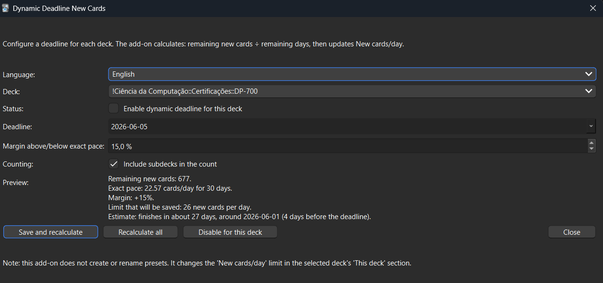

# Dynamic Deadline New Cards

An Anki add-on that automatically adjusts a deck's **new cards/day** limit based on a deadline.

You choose a deck, set a target date, and the add-on calculates how many new cards per day are needed to finish the remaining new cards by that deadline. It can also apply a percentage margin, such as `+20%`, to help you finish earlier.

The add-on updates:

```text
Deck Options > Daily Limits > New cards/day > This deck
```

It does **not** create or rename option presets.

---

## Features

- Set a deadline for a specific Anki deck
- Automatically calculate the required number of new cards per day
- Update the deck-specific **This deck** new-card limit
- Optionally include subdecks in the calculation
- Add a positive or negative percentage margin
- Preview the estimated finish date
- Preview the calculated daily new-card limit
- Recalculate manually from the Tools menu
- Recalculate automatically when:
  - Anki opens
  - Anki syncs
  - new notes/cards are added
  - Anki remains open for a while
- Interface available in:
  - English
  - Portuguese



---

## Why this add-on exists

Anki lets you set a fixed number of new cards per day, but it does not automatically adjust that number based on a deadline.

For example, if you have:

```text
150 new cards
30 days until the deadline
```

the add-on calculates:

```text
150 / 30 = 5 new cards per day
```

If the next day you add 20 more cards, the add-on recalculates:

```text
170 new cards
29 days remaining
170 / 29 = 5.86
```

The result is rounded up:

```text
6 new cards per day
```

This keeps your deck on pace automatically.

---

## Margin option

The margin lets you do more or fewer cards than the exact amount needed.

Examples:

```text
0% margin   = exact pace to finish on the deadline
+20% margin = do 20% more per day and likely finish earlier
-10% margin = do 10% fewer per day and likely finish later
```

Example:

```text
150 new cards
30 days remaining
0% margin
= 5 new cards/day
```

With a `+20%` margin:

```text
5 + 20% = 6 new cards/day
```

This would likely finish the deck in about 25 days instead of 30.

---

## Installation

### From AnkiWeb

1. Open Anki Desktop.
2. Go to:

```text
Tools > Add-ons > Get Add-ons...
```

3. Paste the AnkiWeb add-on code: 233119313
4. Restart Anki.

> Anki Web: [Dynamic Deadline New Cards](https://ankiweb.net/shared/info/233119313?cb=1778110657548)

### Manual installation

1. Download the `.ankiaddon` file.
2. Open Anki Desktop.
3. Go to:

```text
Tools > Add-ons > Install from file...
```

4. Select the `.ankiaddon` file.
5. Restart Anki.

---

## Usage

After installing and restarting Anki, open:

```text
Tools > Dynamic Deadline: Configure...
```

Then:

1. Select a deck.
2. Choose a deadline.
3. Choose whether to include subdecks.
4. Set a margin percentage if desired.
5. Check the preview.
6. Save.

The add-on will update the selected deck's daily new-card limit automatically.

---

## Language

The add-on uses **English by default**.

You can switch the interface language inside the configuration window.

Available languages:

- English
- Portuguese

---

## How deck tracking works

The add-on tracks decks using Anki's internal **deck ID**, not the deck name.

This means:

- Renaming a deck will not break the configuration.
- Deleting a deck and creating another deck with the same name will require configuring the add-on again, because the new deck will have a different internal ID.

If subdecks are included, the add-on checks the current subdeck structure at calculation time. Newly created subdecks can therefore be included automatically if they belong under the configured parent deck.

---

## Important notes

This add-on changes the deck-specific daily new-card limit:

```text
New cards/day > This deck
```

It does not modify the shared option preset's global new-card limit.

This is intentional. It avoids changing other decks that may use the same preset.

---

## Compatibility

Designed for recent Anki Desktop versions.

Recommended minimum version:

```text
Anki 2.1.66
```

This add-on is intended for Anki Desktop. It does not run directly on AnkiWeb, AnkiMobile, or AnkiDroid.

---

## Support

For issues, suggestions, or bug reports, use the GitHub profile/repository:

```text
https://github.com/danyelbarboza
```

If reporting a bug, please include:

- your Anki version
- your operating system
- what you were trying to do
- the error message or traceback, if any
- whether the deck has subdecks
- whether the deadline/margin calculation looked wrong

---

## Changelog

### Initial public version

- Deadline-based new-card limit calculation
- Deck-specific `This deck` limit update
- Optional subdeck inclusion
- Percentage margin
- Estimated finish preview
- English and Portuguese interface

## Telemetry

This add-on ships with the embedded **Anki Census client**.

- No user setup is required (zero-config).
- It reuses shared global census state when available.
- Users can still opt out globally from any integrated add-on settings.

